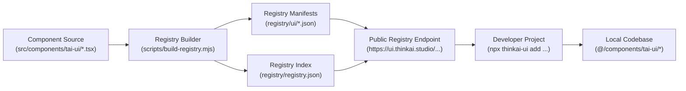

<div align="center">

```text
  ████████╗██╗  ██╗██╗███╗   ██╗██╗  ██╗ █████╗ ██╗     ██╗   ██╗██╗
  ╚══██╔══╝██║  ██║██║████╗  ██║██║ ██╔╝██╔══██╗██║     ██║   ██║██║
     ██║   ███████║██║██╔██╗ ██║█████╔╝ ███████║██║     ██║   ██║██║
     ██║   ██╔══██║██║██║╚██╗██║██╔═██╗ ██╔══██║██║     ██║   ██║██║
     ██║   ██║  ██║██║██║ ╚████║██║  ██╗██║  ██║███████╗╚██████╔╝██║
     ╚═╝   ╚═╝  ╚═╝╚═╝╚═╝  ╚═══╝╚═╝  ╚═╝╚═╝  ╚═╝╚══════╝ ╚═════╝ ╚═╝
```

### **ThinkAI Studio — Official UI Component Registry**

*0px Sharp Architectural Geometry · Obsidian Monochromatic Depth · Infrastructure-Grade Motion Physics*

[](LICENSE)
[](https://nextjs.org)
[](https://tailwindcss.com)
[](https://www.typescriptlang.org)
[](https://react.dev)
[](https://motion.dev)
[](DESIGN.md)

<p align="center">
  <a href="#-executive-summary">Overview</a> •
  <a href="#-quick-start--cli-usage">Quick Start</a> •
  <a href="#%EF%B8%8F-core-architectural-pillars">Pillars</a> •
  <a href="#-the-production-hallmark-contrast-matrix">Comparison Matrix</a> •
  <a href="#-production-component-catalog-47-primitives">Component Catalog</a> •
  <a href="#-design-tokens--global-configuration">Design Tokens</a> •
  <a href="#%EF%B8%8F-registry-architecture">Architecture</a>
</p>

---

</div>

## 📌 Executive Summary

**`thinkai-ui`** is an **infrastructure-grade, registry-first component collection** engineered for technical luxury and high-conviction digital products.

Instead of an opaque, immutable NPM dependency, **`thinkai-ui` distributes code directly into your repository**. You retain 100% source ownership, zero lock-in, and instant customizability over every pixel, curve, and shader.

> **Design Tenet:** *"Infrastructure-Grade Craft & Technical Luxury"* — Interfaces engineered with the precision, reliability, and tactile weight of distributed server infrastructure.

---

## 🏛️ Core Architectural Pillars

```
┌───────────────────────────────┬───────────────────────────────┐
│  01. OBSIDIAN MONOCHROME      │  02. 0px ARCHITECTURAL FORM   │
│  Layered #08080a / #131316    │  Strict 90° corners, 0px rad  │
│  Top-inset 1px alpha highlights│  Rigid 4px mathematical grid  │
│  LED nominal status `#4ade80` │  High-contrast crisp focus    │
├───────────────────────────────┼───────────────────────────────┤
│  03. TECTONIC MOTION PHYSICS  │  04. REGISTRY DECENTRALIZATION│
│  Frictionless mechanical mass │  Direct code ownership in src │
│  Luxury `[0.16, 1, 0.3, 1]`   │  shadcn-compatible manifests  │
│  WCAG 2.2 AA motion baseline  │  Zero bloated node_modules    │
└───────────────────────────────┴───────────────────────────────┘
```

1. **Obsidian Monochromatic Depth:** Avoids flat pure black `#000000`. Employs deep obsidian canvases (`#08080a`, `#0d0d10`, `#131316`), linear-grade top-inset highlights (`shadow-[inset_0_1px_0_0_rgba(255,255,255,0.08)]`), and dynamic alpha hairlines (`border-white/[0.07]`).
2. **Sharp Architectural Geometry:** Universal **`border-radius: 0px`**. Sharp 90° rectangular forms aligned to an unyielding 4px mathematical grid with high-visibility tactile focus rings.
3. **Tectonic Motion Mechanics:** Physical mass and friction (`{ damping: 32, stiffness: 280, mass: 1 }`), mechanical active compression (`active:scale-[0.98]`), and multi-layer parallax reveals.
4. **Decentralized Distribution:** Pure registry distribution. Every component is completely typed, treeshakeable, polymorphic (`asChild`), and tailored for Next.js 16 App Router & React 19.

---

## ⚡ The Production Hallmark: Contrast Matrix

| Dimension | Standard Generic UI | **ThinkAI Studio (`thinkai-ui`)** |
| :--- | :--- | :--- |
| **Geometry** | `rounded-xl` / `rounded-full` pills | **100% Zero Border-Radius (`rounded-none`)** |
| **Surfaces** | Flat pure black `#000000` | **Obsidian Layered Depth (`#08080a` → `#0d0d10` → `#131316`)** |
| **Borders** | Hardcoded opaque grays (`#27272a`) | **Dynamic Alpha Hairlines (`border-white/[0.07]`)** |
| **Lighting** | Heavy muddy drop shadows | **Linear-Grade 1px Top-Inset Reflections (`inset 0 1px 0 0 white/8%`)** |
| **Motion Physics** | Floating squishy rubber-banding | **Tectonic Heavy Frictionless Mechanics (`stiffness: 280, mass: 1`)** |
| **Click Feedback** | Color opacity change only | **Mechanical Compression (`active:scale-[0.98]`)** |
| **Typography** | 100% pure white (optical bleed) | **Balanced White Alpha (`text-white/90` & `text-white/60`, tight tracking)** |
| **Status Telemetry** | Flat green dots | **Optical LED Glow (`drop-shadow-[0_0_6px_rgba(74,222,128,0.45)]`)** |
| **Code Ownership** | Opaque `node_modules` dependency | **Registry-First: 100% source code ownership in your repository** |

---

## 🏗️ Registry Architecture



---

## 🚀 Quick Start & CLI Usage

### 1. Initialize ThinkAI Foundation

Run the initializer in your Next.js root directory:

```bash
npx thinkai-ui init
```

The CLI automatically configures:
- `src/lib/utils.ts` — Typed `cn()` utility combining `clsx` and `tailwind-merge`.
- `src/lib/motion.ts` — ThinkAI standard spring physics (`TAI_SPRING`) and luxury easing curves (`TAI_EASE`).
- `components.json` — Workspace alias configuration.

### 2. Add Interactive Components

Install individual components with resolved dependencies:

```bash
# Add Core Buttons
npx thinkai-ui add tai-button
npx thinkai-ui add wipe-button

# Add Studio Mockups & WebGL Canvas
npx thinkai-ui add product-mockup
npx thinkai-ui add halftone-banner

# Add Navigation & Overlays
npx thinkai-ui add tai-header
npx thinkai-ui add about-drawer

# Or Install All 47 Components At Once
npx thinkai-ui add --all
```

### 3. List All Available Primitives

```bash
npx thinkai-ui list
```

---

## 📦 Production Component Catalog (47 Primitives)

Every component is written in **TypeScript Strict Mode**, documents its keyboard and reduced-motion behavior, and targets **WCAG 2.2 AA** without overstating unverified compliance.

| Primitive | CLI Command | Category | Key Capabilities & Highlights |
| :--- | :--- | :--- | :--- |
| **TaiButton** | `npx thinkai-ui add tai-button` | *Interactive* | CVA variants, `asChild` Slot, top-inset light sweep, `active:scale-[0.98]` click compression |
| **WipeButton** | `npx thinkai-ui add wipe-button` | *Interactive* | Signature Forward-Wipe interactive fill, luxury easing `[0.16, 1, 0.3, 1]` |
| **ProductMockup** | `npx thinkai-ui add product-mockup` | *Display* | Studio browser/laptop frame, SSL capsule, LED telemetry glow, clip-path reveals |
| **HalftoneBanner** | `npx thinkai-ui add halftone-banner` | *Visual / 3D* | Three.js ocean caustics WebGL canvas integrated with ThinkAI Studio vector mark |
| **ThreeHalftoneCanvas** | `npx thinkai-ui add three-halftone-canvas` | *Engine* | Procedural WebGL ocean shader, 60/120fps throttle, auto-cleanup on unmount |
| **TaiHeader** | `npx thinkai-ui add tai-header` | *Navigation* | Translucent sticky header, zero-border architectural layout, full-bleed mobile drawer |
| **AboutDrawer** | `npx thinkai-ui add about-drawer` | *Overlay* | High-contrast spring sliding sheet, Lenis scroll prevention, ESC keyboard trapping |
| **ArchitectureModal** | `npx thinkai-ui add architecture-modal` | *Overlay* | Multi-tab deep-dive system architecture dialog, telemetry tabs, code verification |
| **ContactModal** | `npx thinkai-ui add contact-modal` | *Overlay* | Sharp geometric contact dialog, instant clipboard copier, optical micro-toast |
| **MaskedTextReveal** | `npx thinkai-ui add masked-text-reveal` | *Typography* | Editorial typography reveal via geometric `clip-path: inset()` masking |
| **TextRoll** | `npx thinkai-ui add text-roll` | *Typography* | High-speed tumbler slot-machine roll for headlines and metrics |
| **ButtonTextRoll** | `npx thinkai-ui add button-text-roll` | *Typography* | Dual-layer micro-tumbler for kinetic button labels |
| **ArrowRoll** | `npx thinkai-ui add arrow-roll` | *Micro* | Directional forward translation arrow with spring physics |
| **SmoothScroll** | `npx thinkai-ui add smooth-scroll` | *Provider* | Lenis 120Hz smooth scrolling coordination with touch and anchor normalization |
| **AiBrandIcons** | `npx thinkai-ui add ai-brand-icons` | *Vectors* | Pure SVG brand marks: Claude, Gemini, OpenAI, Groq, Ollama, DeepSeek |
| **TechLogos** | `npx thinkai-ui add tech-logos` | *Display* | High-contrast inverted hover tiles with snappy spring lift physics |
| **TaiInput** | `npx thinkai-ui add tai-input` | *Forms* | Labelled input with description, invalid, and disabled states |
| **TaiSelect** | `npx thinkai-ui add tai-select` | *Forms* | Native select shell with explicit options and error state |
| **TaiCheckbox** | `npx thinkai-ui add tai-checkbox` | *Controls* | Native checkbox with visible focus and label association |
| **TaiSwitch** | `npx thinkai-ui add tai-switch` | *Controls* | Immediate on/off control with switch semantics |
| **TaiTabs** | `npx thinkai-ui add tai-tabs` | *Disclosure* | Keyboard-navigable tablist and panels |
| **TaiAccordion** | `npx thinkai-ui add tai-accordion` | *Disclosure* | Single-open progressive disclosure primitive |
| **TaiDialog** | `npx thinkai-ui add tai-dialog` | *Overlay* | Focused modal surface with Escape and backdrop dismissal |
| **TaiToast** | `npx thinkai-ui add tai-toast` | *Feedback* | Quiet live notification for non-blocking feedback |
| **TextScramble** | `npx thinkai-ui add text-scramble` | *Motion* | Finite character transition for known display text |
| **TextMorph** | `npx thinkai-ui add text-morph` | *Motion* | Small crossfade for changing text values |
| **TextRevealBlock** | `npx thinkai-ui add text-reveal-block` | *Motion* | One-shot block reveal for short headings |
| **DrawUnderline** | `npx thinkai-ui add draw-underline` | *Motion* | Restrained underline draw for links and emphasis |
| **BorderTrail** | `npx thinkai-ui add border-trail` | *Motion* | Sparse attention trail for a focused surface |
| **NumberFlow** | `npx thinkai-ui add number-flow` | *Motion* | Small numeric settle for real changing values |
| **FadeIn** | `npx thinkai-ui add fade-in` | *Motion* | Small opacity and position entry for content blocks |
| **BlurReveal** | `npx thinkai-ui add blur-reveal` | *Motion* | Restrained blur-to-clear reveal for editorial content |
| **StaggerGroup** | `npx thinkai-ui add stagger-group` | *Motion* | Shared stagger context for small content groups |
| **Highlight** | `npx thinkai-ui add highlight` | *Motion* | One-shot accent highlight for important text |
| **ProgressiveBlur** | `npx thinkai-ui add progressive-blur` | *Motion* | Edge fade for scrollable content surfaces |
| **SkeletonShimmer** | `npx thinkai-ui add skeleton-shimmer` | *Motion* | Slow finite loading sweep with reduced-motion fallback |
| **TaiTooltip** | `npx thinkai-ui add tai-tooltip` | *Feedback* | Labelled hover and keyboard tooltip primitive |
| **TaiPopover** | `npx thinkai-ui add tai-popover` | *Overlay* | Lightweight anchored disclosure surface |
| **TaiDropdownMenu** | `npx thinkai-ui add tai-dropdown-menu` | *Navigation* | Keyboard-friendly action menu with Escape dismissal |
| **TaiAlert** | `npx thinkai-ui add tai-alert` | *Feedback* | Persistent status message with semantic live region |
| **TaiBadge** | `npx thinkai-ui add tai-badge` | *Display* | Compact status and category label |
| **TaiSkeleton** | `npx thinkai-ui add tai-skeleton` | *Feedback* | Quiet static loading placeholder |
| **TaiSeparator** | `npx thinkai-ui add tai-separator` | *Layout* | Semantic horizontal or vertical divider |
| **TaiAvatar** | `npx thinkai-ui add tai-avatar` | *Display* | Initials avatar with accessible label |
| **TaiIconButton** | `npx thinkai-ui add tai-icon-button` | *Controls* | Labelled icon-only control with focus treatment |
| **TaiEmptyState** | `npx thinkai-ui add tai-empty-state` | *Feedback* | Clear empty collection state with optional action |
| **TaiBottomSheet** | `npx thinkai-ui add tai-bottom-sheet` | *Overlay* | Mobile-first sheet with focus management and Escape dismissal |

---

## 🎨 Design Tokens & Global Configuration

`thinkai-ui` is built natively on **Tailwind CSS v4** token architecture.

### Color Tokens (`globals.css`)

```css
@theme {
  --color-tai-bg: #08080a;             /* Deep obsidian canvas */
  --color-tai-sheet: #0d0d10;          /* Raised surface layer */
  --color-tai-card: #131316;           /* Card surface / Bezel mockup */
  --color-tai-border: rgba(255, 255, 255, 0.07);        /* Alpha hairline border */
  --color-tai-border-strong: rgba(255, 255, 255, 0.18); /* Active/hover border */
  --color-tai-green: #4ade80;          /* Nominal LED status glow */

  --ease-spring: cubic-bezier(0.32, 0.72, 0, 1);
  --ease-luxury: cubic-bezier(0.16, 1, 0.3, 1);
}
```

### Motion Curves (`src/lib/motion.ts`)

```ts
export const TAI_EASE = {
  luxury: [0.16, 1, 0.3, 1] as const,     // Reveal, dialog, sheet transitions
  snappy: [0.19, 1, 0.22, 1] as const,    // Button hover, tab indicators
  spring: [0.32, 0.72, 0, 1] as const,   // Viewport entry transitions
};

export const TAI_SPRING = {
  default: { type: "spring", damping: 32, stiffness: 280, mass: 1 },
  stiff:   { type: "spring", damping: 30, stiffness: 400, mass: 0.8 },
  gentle:  { type: "spring", damping: 38, stiffness: 200, mass: 1.2 },
} as const;
```

---

## ♿ WCAG 2.2 AA Accessibility & Reduced Motion

All components strictly honor `prefers-reduced-motion: reduce` through four deterministic strategies:

1. **Bail (GPU Offloading):** Ambient particle canvas & WebGL drift immediately halt, releasing GPU threads.
2. **Snap to End State:** Scroll-driven typography rolls and reveals render at `opacity: 1` and `transform: none`.
3. **Collapse Transitions:** Button wipes and drawer sliding times collapse to instant updates (`0.01ms`).
4. **Contrast Integrity:** Monochromatic borders maintain minimum 4.5:1 text-to-background contrast with crisp 2px focus outlines (`outline: 2px solid rgba(255, 255, 255, 0.85)`).

---

## 📖 Deep Specification

For complete mathematical clamp formulas, architectural diagrams, and font tracking tables, read the official [`DESIGN.md`](DESIGN.md).

---

## 📄 License & Attribution

- **Design Lineage:** Inspired by the contemporary dark-mode editorial precision pioneered by *Linear*, *Vercel*, and *SoraLabs*.
- **Implementation:** Clean-room implementation built from scratch with React 19, Motion, Three.js, and Tailwind CSS v4.
- **License:** Open-source under the [MIT License](./LICENSE).

<div align="center">
  <sub>Engineered with precision by <strong>ThinkAI Studio / Nguyen Huu Binh Minh</strong> © 2026.</sub>
</div>
